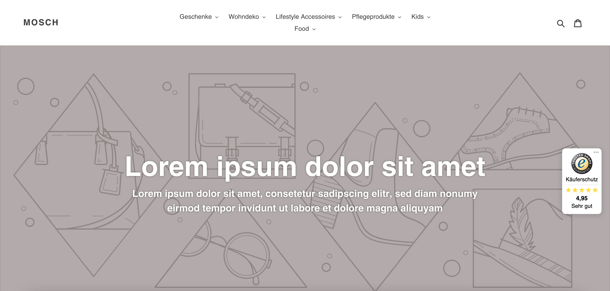
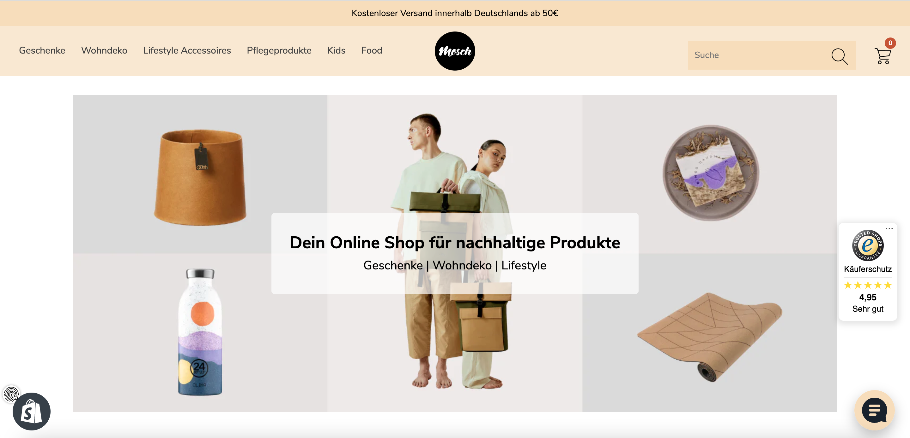
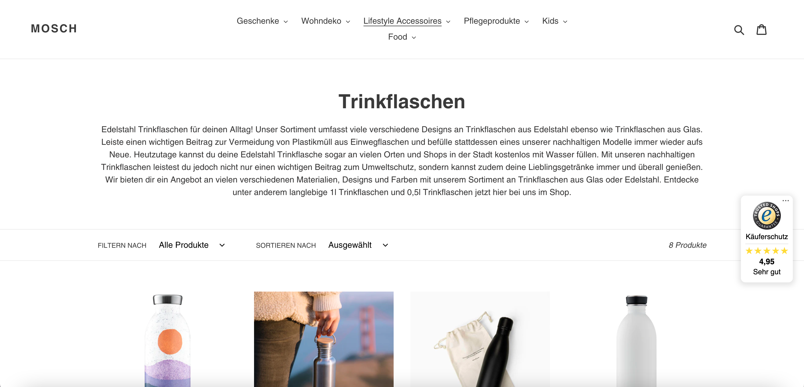
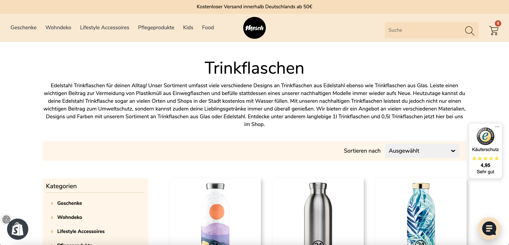
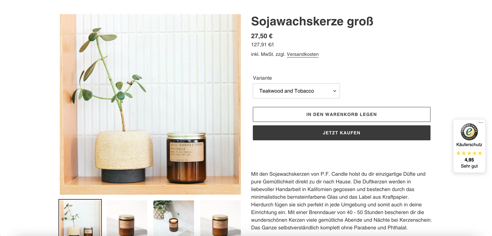
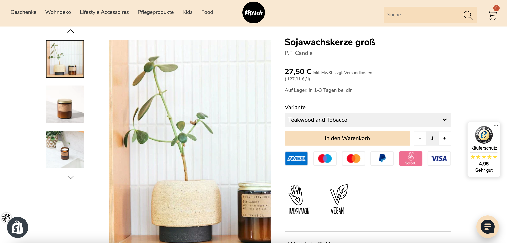
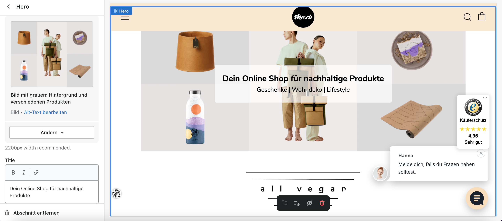
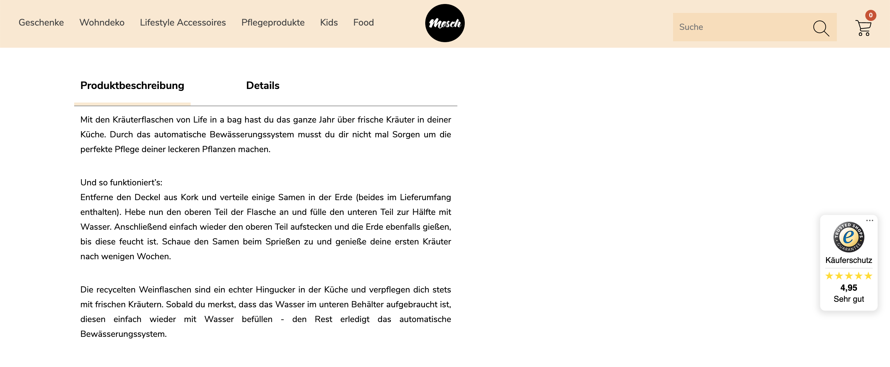

# Shopify Webshop

mosch is a Shopify webshop for sustainable products and is build with the Venue theme. 

## Technologies

- CSS
- JavaScript
- Liquid
- Shopify

## Layout changes

mosch uses the Shopify Venue theme and therefor most functionalities were already build-in. However, many changes in the CSS files to implement the coperate design of mosch have been made. 

Homepage</br>



Collection page</br>



Product page</br>



## Making Components
Besides the changes in the CSS files, I also created a simple component. This component creates a text field over an image. The Shop owner can change the image and the text on the Shopify platform.



```
<div class="hero-bild-section">

                     
  					 
                                      
  
  <div class="hero-text">
    <h1 class="hero-text-title">{{ section.settings.hero_title }}</h1>
    <h3 class="hero-text-p">{{ section.settings.hero_text }}</h3>
  </div>
	
</div>

 <div class="all-vegan">
    
  </div>



  {
    "name": "Hero",
    "settings": [
{
            "type": "image_picker",
            "id": "hero_image_landscape",
            "label": "Hero image landscape",
            "info": "2200px width recommended."
        },
{
            "type": "image_picker",
            "id": "hero_image_portrait",
            "label": "Hero image portrait",
            "info": "2200px width recommended."
        },
{
            "type": "richtext",
            "id": "hero_title",
            "label": "Title",
            "default": "<p>Some sort of title</p>"
        },
{
            "type": "richtext",
            "id": "hero_text",
            "label": "Hero text"
}
],
	"presets": [
	{
	"name": "Hero section",
	"category": "ADVANCED LAYOUT"
	}
]
  }

```


## Using Liquid and JavaScript

I changed the pagination. Instead of rendering only the product also all the product variants needed to be renderd. 
```


    
        <div class="o-layout__item u-1/{{ section.settings.grid_mobile }} {{ grid_item_width }}">                                                                                        
                                       
        </div>           

    

        
            <div class="o-layout__item u-1/{{ section.settings.grid_mobile }} {{ grid_item_width }}">
                                           
            </div>
        

    

...
```
An example where I used Javascript is the product page. Here I made it possible to switch between the two tabs “Produktbeschreibung” and “Details”.




```
<script> 
const tabDescription = document.querySelector('.tab-description');
const tabDetails = document.querySelector('.tab-details');
const tabOne = document.querySelector('#tab1');
const tabTwo = document.querySelector('#tab2');

tabDescription.addEventListener('click', () =>{
                     tabOne.style.display = 'block';
                     tabTwo.style.display = 'none';
                     tabDescription.style.borderBottom = '5px solid #f9e9d0';
                     tabDetails.style.borderBottom = 'none';
                     });
                     
tabDetails.addEventListener('click', () =>{
                     tabOne.style.display = 'none';
                     tabTwo.style.display = 'block';
                     tabDetails.style.borderBottom = '5px solid #f9e9d0';
                     tabDescription.style.borderBottom = 'none';
                     });
</script>
```
